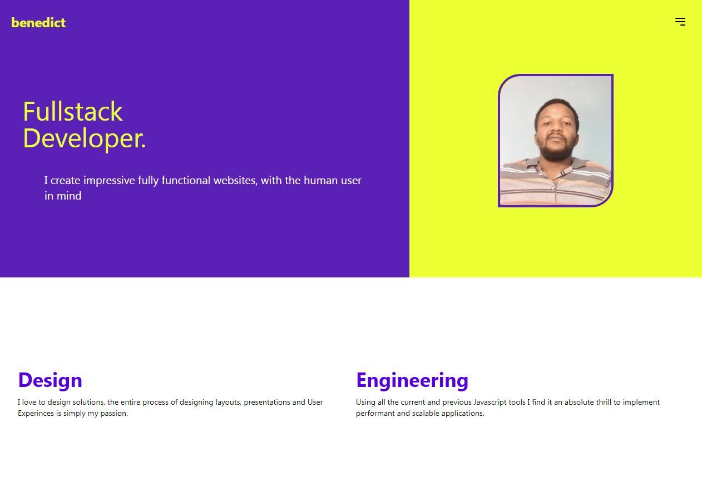

# Portfolio Website



## Table of Contents
- [Introduction](#introduction)
- [Features](#features)
- [Tech Stack](#tech-stack)
- [Getting Started](#getting-started)
- [Usage](#usage)
- [Contributing](#contributing)
- [License](#license)
- [Contact](#contact)

## Introduction
Welcome to my portfolio website repository! This project is a personal portfolio built with React and Tailwind CSS to showcase my skills, projects, and experience. It is designed to be responsive, fast, and easy to navigate.

## Features
- Responsive design
- Dynamic project showcase
- Interactive UI components
- Smooth scrolling and animations
- Contact form integration
- SEO optimized

## Tech Stack
- **Frontend:** React, Tailwind CSS
- **Deployment:** Vercel
- **Additional Libraries:** 
  - React Router
  - Framer Motion (for animations)
  - EmailJS (for contact form)

## Getting Started

### Prerequisites
- Node.js (v12.x or later)
- npm or yarn

### Installation
1. Clone the repository:
    ```bash
    git clone https://github.com/BenedictJoachim/benedict
    cd benedict
    ```

2. Install dependencies:
    ```bash
    npm install
    # or
    yarn install
    ```

3. Start the development server:
    ```bash
    npm start
    # or
    yarn start
    ```

Your portfolio website should now be running on `http://localhost:3000`.

### Build for Production
To create a production build, run:
```bash
npm run build
# or
yarn build
